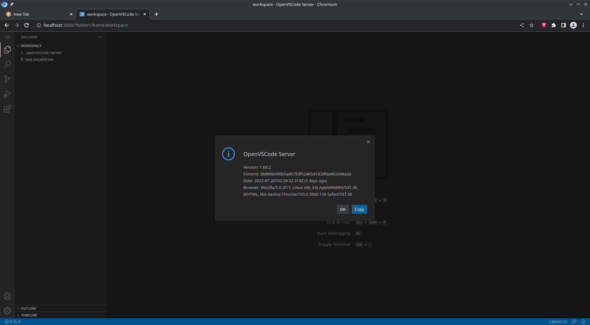
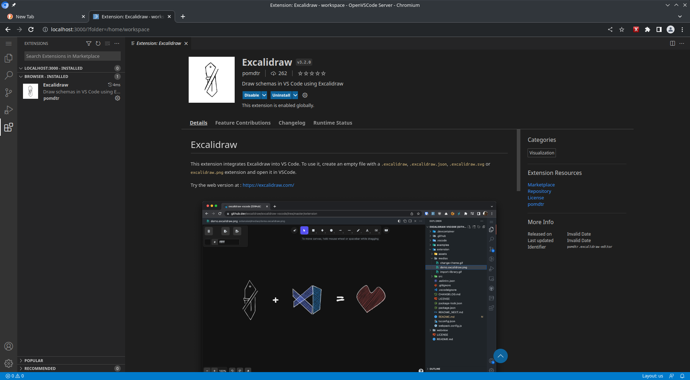
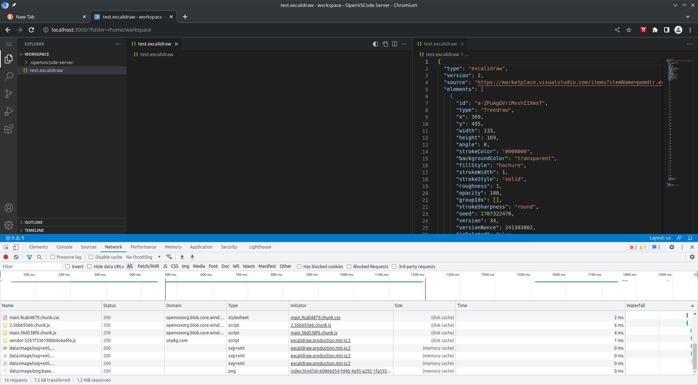
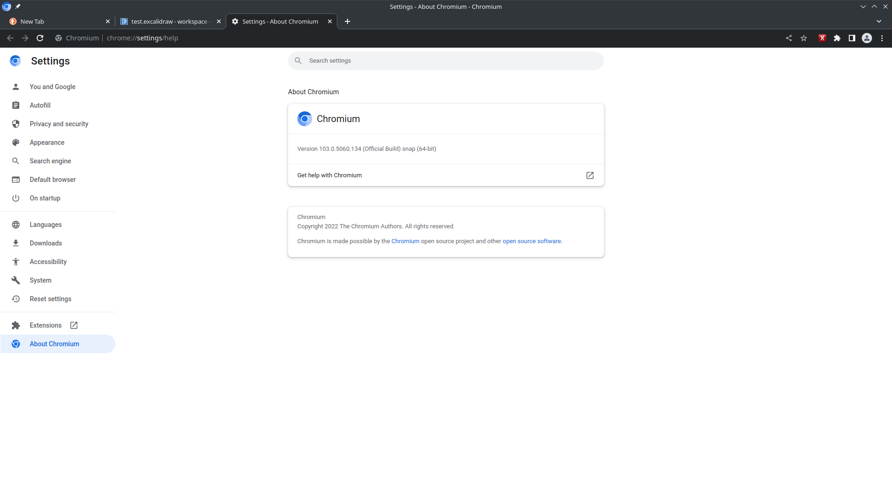
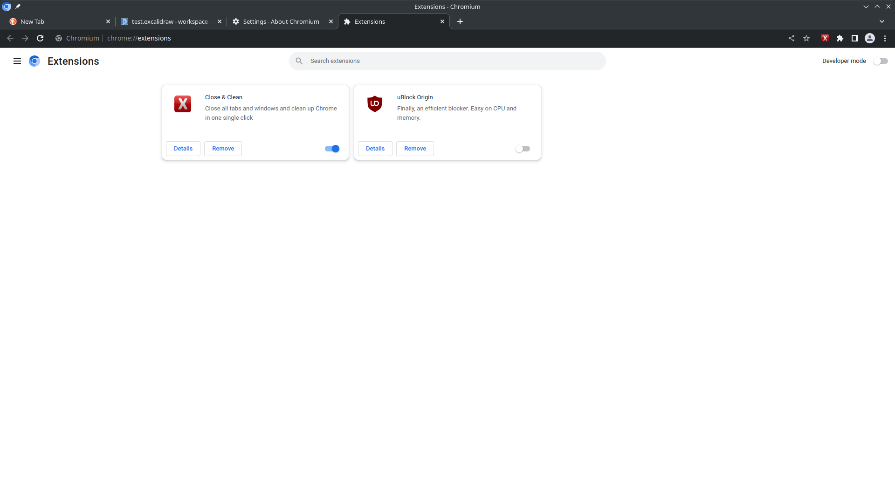

# Issue: gitpod/openvscode-server excalidraw preview not displayed

When using the gitpod/openvscode-server docker image installing the Excalidraw extension in Chromium, the preview will not be displayed, when it a *.excalidraw file is opened inside the editor.

## How to reproduce the issue

1. Run `docker compose up --detach`
2. Visit `http://localhost:3000/?folder=/home/workspace` in your browser
3. Navigate to the extensions store and install the Excalidraw plugin `pomdtr.excalidraw-editor`
4. Open the readonly file `test.excalidraw` in the editor

There are no exceptions logged into the Browser Console, it appears that the svg graphics are fetched from the server successfully (Status 200 OK), but no excalidraw preview / editor is displayed.

See captures from the Browser Dev Tools (Network Tab), every time the excalidraw preview / editor is reopened these 4 requests (and some other, that do succeed) are created by the browser:

```
Request URL: data:image/svg+xml,%3Csvg%20aria-hidden%3D%22true%22%20focusable%3D%22false%22%20data-prefix%3D%22fas%22%20data-icon%3D%22image%22%20class%3D%22svg-inline--fa%20fa-image%20fa-w-16%22%20role%3D%22img%22%20xmlns%3D%22http%3A%2F%2Fwww.w3.org%2F2000%2Fsvg%22%20viewBox%3D%220%200%20512%20512%22%3E%3Cpath%20fill%3D%22%23888%22%20d%3D%22M464%20448H48c-26.51%200-48-21.49-48-48V112c0-26.51%2021.49-48%2048-48h416c26.51%200%2048%2021.49%2048%2048v288c0%2026.51-21.49%2048-48%2048zM112%20120c-30.928%200-56%2025.072-56%2056s25.072%2056%2056%2056%2056-25.072%2056-56-25.072-56-56-56zM64%20384h384V272l-87.515-87.515c-4.686-4.686-12.284-4.686-16.971%200L208%20320l-55.515-55.515c-4.686-4.686-12.284-4.686-16.971%200L64%20336v48z%22%3E%3C%2Fpath%3E%3C%2Fsvg%3E
Request Method: GET
Status Code: 200 OK (from memory cache)
Referrer Policy: strict-origin-when-cross-origin
Content-Type: image/svg+xml
Provisional headers are shown. Disable cache to see full headers.
Learn more
Referer
User-Agent: Mozilla/5.0 (X11; Linux x86_64) AppleWebKit/537.36 (KHTML, like Gecko) Chrome/103.0.5060.134 Safari/537.36
```

```
Request URL: data:image/svg+xml,%3Csvg%20viewBox%3D%220%200%20668%20668%22%20xmlns%3D%22http%3A%2F%2Fwww.w3.org%2F2000%2Fsvg%22%20xml%3Aspace%3D%22preserve%22%20style%3D%22fill-rule%3Aevenodd%3Bclip-rule%3Aevenodd%3Bstroke-linejoin%3Around%3Bstroke-miterlimit%3A2%22%3E%3Cpath%20d%3D%22M464%20448H48c-26.51%200-48-21.49-48-48V112c0-26.51%2021.49-48%2048-48h416c26.51%200%2048%2021.49%2048%2048v288c0%2026.51-21.49%2048-48%2048ZM112%20120c-30.928%200-56%2025.072-56%2056s25.072%2056%2056%2056%2056-25.072%2056-56-25.072-56-56-56ZM64%20384h384V272l-87.515-87.515c-4.686-4.686-12.284-4.686-16.971%200L208%20320l-55.515-55.515c-4.686-4.686-12.284-4.686-16.971%200L64%20336v48Z%22%20style%3D%22fill%3A%23888%3Bfill-rule%3Anonzero%22%20transform%3D%22matrix(.81709%200%200%20.81709%20124.825%20145.825)%22%2F%3E%3Cpath%20d%3D%22M256%208C119.034%208%208%20119.033%208%20256c0%20136.967%20111.034%20248%20248%20248s248-111.034%20248-248S392.967%208%20256%208Zm130.108%20117.892c65.448%2065.448%2070%20165.481%2020.677%20235.637L150.47%20105.216c70.204-49.356%20170.226-44.735%20235.638%2020.676ZM125.892%20386.108c-65.448-65.448-70-165.481-20.677-235.637L361.53%20406.784c-70.203%2049.356-170.226%2044.736-235.638-20.676Z%22%20style%3D%22fill%3A%23888%3Bfill-rule%3Anonzero%22%20transform%3D%22matrix(.30366%200%200%20.30366%20506.822%2060.065)%22%2F%3E%3C%2Fsvg%3E
Request Method: GET
Status Code: 200 OK (from memory cache)
Referrer Policy: strict-origin-when-cross-origin
Content-Type: image/svg+xml
Provisional headers are shown. Disable cache to see full headers.
Learn more
Referer
User-Agent: Mozilla/5.0 (X11; Linux x86_64) AppleWebKit/537.36 (KHTML, like Gecko) Chrome/103.0.5060.134 Safari/537.36
```

```
Request URL: data:image/svg+xml, %3Csvg%20xmlns%3D%22http%3A%2F%2Fwww.w3.org%2F2000%2Fsvg%22%20width%3D%2216%22%20height%3D%2216%22%20viewBox%3D%220%200%2024%2024%22%20fill%3D%22none%22%20stroke%3D%22%231971c2%22%20stroke-width%3D%222%22%20stroke-linecap%3D%22round%22%20stroke-linejoin%3D%22round%22%20class%3D%22feather%20feather-external-link%22%3E%3Cpath%20d%3D%22M18%2013v6a2%202%200%200%201-2%202H5a2%202%200%200%201-2-2V8a2%202%200%200%201%202-2h6%22%3E%3C%2Fpath%3E%3Cpolyline%20points%3D%2215%203%2021%203%2021%209%22%3E%3C%2Fpolyline%3E%3Cline%20x1%3D%2210%22%20y1%3D%2214%22%20x2%3D%2221%22%20y2%3D%223%22%3E%3C%2Fline%3E%3C%2Fsvg%3E
Request Method: GET
Status Code: 200 OK (from memory cache)
Referrer Policy: strict-origin-when-cross-origin
Content-Type: image/svg+xml
Provisional headers are shown. Disable cache to see full headers.
Learn more
Referer
User-Agent: Mozilla/5.0 (X11; Linux x86_64) AppleWebKit/537.36 (KHTML, like Gecko) Chrome/103.0.5060.134 Safari/537.36
```

```
Request URL: data:image/png;base64,iVBORw0KGgoAAAANSUhEUgAAABAAAAAQCAYAAAAf8/9hAAAAMUlEQVQ4T2NkYGAQYcAP3uCTZhw1gGGYhAGBZIA/nYDCgBDAm9BGDWAAJyRCgLaBCAAgXwixzAS0pgAAAABJRU5ErkJggg==
Request Method: GET
Status Code: 200 OK (from memory cache)
Referrer Policy: strict-origin-when-cross-origin
Content-Type: image/png
Provisional headers are shown. Disable cache to see full headers.
Learn more
Referer
User-Agent: Mozilla/5.0 (X11; Linux x86_64) AppleWebKit/537.36 (KHTML, like Gecko) Chrome/103.0.5060.134 Safari/537.36
```

## Expected Behavior

The excalidraw preview / editor should be usable when working on `http://localhost:3000` without even a reverse proxy (that may cause issues due to some CORS, etc settings).

## Used Versions
- gitpod/openvscode-server docker image [v1.69.2](https://hub.docker.com/r/gitpod/openvscode-server) and installing 
- Chromium 103.0.5060.134 (snap)
  - with no relevant extensions enabled, that may block content
  - with no additional security settings being configured (e.g. Third-Party Cookie Blocking, etc)
  - running on Ubuntu 22.04 with KDE installed ( `sudo apt install kde-full` )
- Excalidraw version 3.2.0 installed via extensions store

## Additional Screenshots










